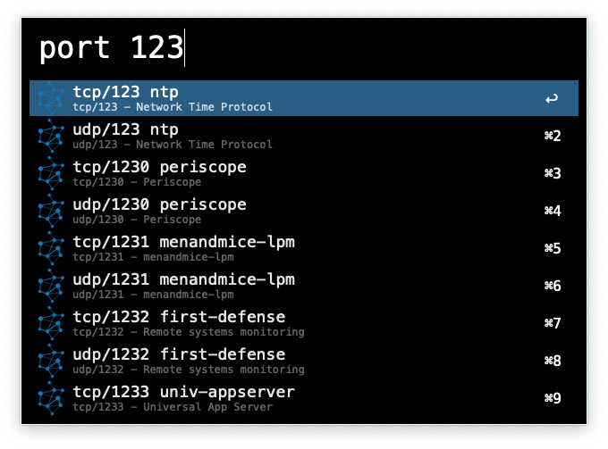
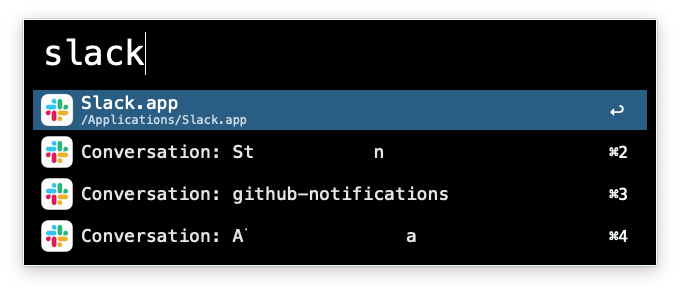
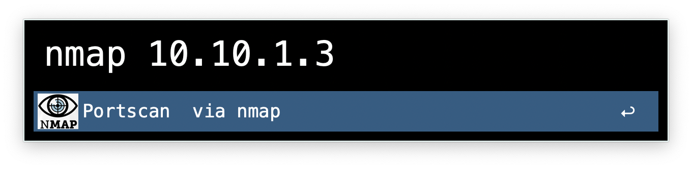
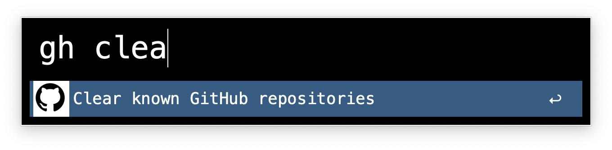
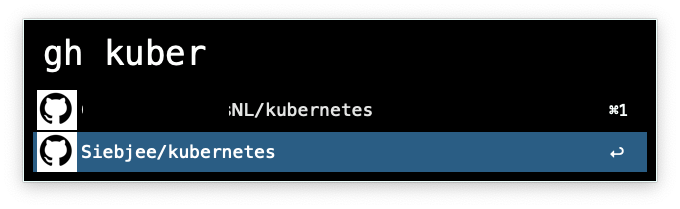
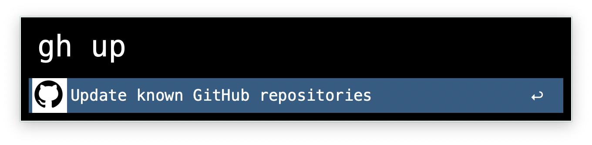
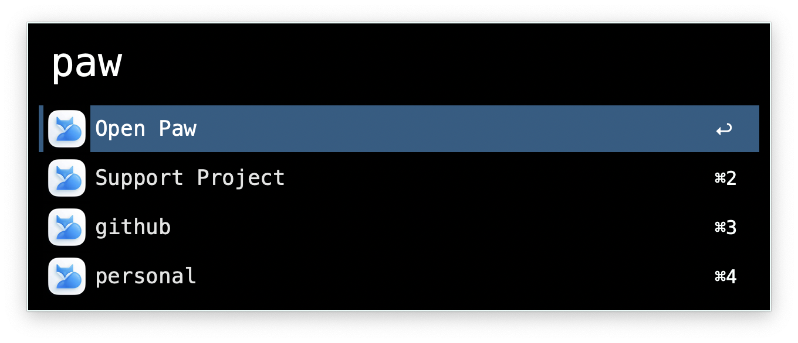

# Port workflow
Use keyword `port` and a port number to lookup the default serice of that port.

# Slack workflow
Use keyword `slack` and it shows you your recent chats.

# NMAP workflow
Use keyword: `nmap` and a target `10.10.10.10` to start a simple portscan.

# GitHub workflow
Use keyword `gh clear` to clear the known repositories.

Use keyword `gh` and a repository name to quickly open this repository in your browser.

Modifiers:
- `command` - Copy ssh clone URL
- `option` - Copy HTTPS clone URL
- `control` - Open pull request dashboard

Use keyword `gh update` to update the known repositories using the github API and your access token.

# RapidAPI workflow
Configure:
- keyword, default `paw`
- location, example: `/path/to my/projects/dir`

Use keyword `paw` to open the application. Or search for your RapidAPI project.

